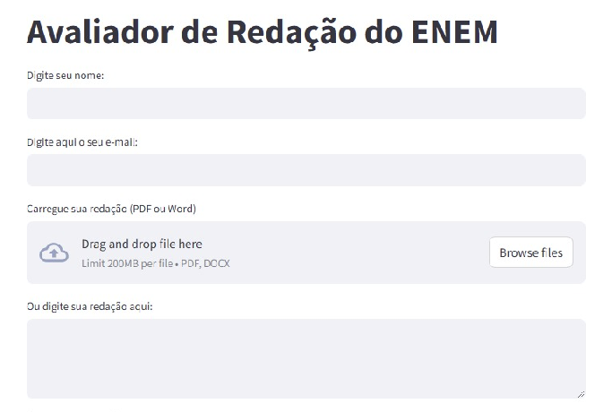

# 📑 Avaliador de Redação do ENEM

### Equipe:
- Danilo Pontes;
- Jonatha Silva;
- Sanderson Rawan;
- Saulo Bernardo;
- Washington França;
- Wiliams Alves.



## 🎯 Objetivo do Projeto
O projeto tem como objetivo desenvolver um sistema automatizado de correção de redações do ENEM. Ele utiliza modelos de linguagem para avaliar textos com base nos critérios oficiais do exame, proporcionando feedback detalhado e pontuação em cada uma das cinco competências avaliadas.

## 💡 Ideia do Protótipo
O protótipo permite que os usuários submetam suas redações em formato de texto ou arquivo (“.pdf” ou “.docx”), e um modelo de linguagem (LLM) processa a análise. O resultado apresenta uma nota para cada competência e um feedback detalhado. Além disso, o sistema permite o envio do relatório de avaliação por e-mail ao usuário.

## 🔎 Engenharia de Prompt do Modelo
O modelo utiliza um prompt detalhado que instrui a IA a avaliar a redação com base nos seguintes critérios:
1. **Domínio da modalidade escrita formal da língua portuguesa**
2. **Compreensão da proposta de redação e desenvolvimento do tema**
3. **Seleção, relação e organização de informações e argumentos**
4. **Conhecimento dos mecanismos linguísticos para a construção da argumentação**
5. **Proposta de intervenção**

A IA atribui notas de 0 a 200 para cada competência e gera uma nota final de 0 a 1000 pontos. O feedback é estruturado de forma detalhada para auxiliar no aprimoramento da escrita do aluno.

## 🛠 Tecnologias Usadas
- **Linguagem de Programação:** Python
- **Framework para Interface:** Streamlit
- **Modelos de Linguagem:** OpenAI (GPT-3.5 Turbo, GPT-4o), Groq (LLaMA 3.3 70B)
- **Processamento de Arquivos:** PyMuPDF (fitz) e python-docx
- **Envio de E-mail:** smtplib, ssl, email.message
- **Gerenciamento de Variáveis de Ambiente:** dotenv

## 📂 Estrutura do Projeto
```
📁 avaliador_redacao
│── 📄 app2.py  # Arquivo principal do aplicativo
│── 📄 requirements.txt  # Dependências do projeto
│── 📄 .env  # Configuração de variáveis de ambiente (exemplo: credenciais de e-mail)
│── 📁 dados teste  # Documentos usados para validar a aplicação
│── 📁 outros scripts  # Scripts para melhorias futuras
│── 📁 imagens  # Imagens que ilustrão o projeto
```

## 📌 Pontos de Melhoria
1. **Otimização do processamento da redação:** Melhorar a precisão na extração de textos de arquivos PDF e Word.
2. **Aprimoramento do feedback:** Tornar as sugestões mais detalhadas e alinhadas com o perfil do aluno.
3. **Interface aprimorada:** Tornar o sistema mais intuitivo e interativo.
4. **Treinamento de modelos próprios:** Criar um modelo ajustado para correção de redações com base em redações do ENEM.